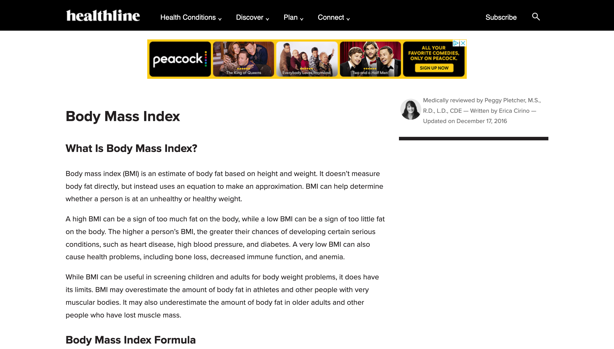
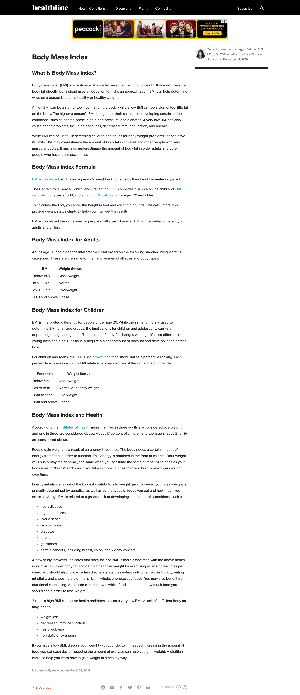

# 🏥 Healthline BMI Page — HTML/CSS Clone

A clean and structured clone of a **Healthline-style BMI article page**, recreated using **pure HTML and CSS**.  
This project demonstrates strong foundational layout skills, page structuring, spacing, typography, and visual accuracy — all without JavaScript or responsive design.


---

## 🚀 Features

- 📄 **Static clone of a Healthline article page**
- 📰 **Well-structured content sections**
- 🎨 **Consistent spacing, colors, and typography**
- 📌 **Sticky navigation bar**
- 🧩 **BMI information tables**
- 🖼️ **Images, sidebar blocks, banners**
- 💅 **Pure CSS styling (no frameworks)**
- ⚠️ **No responsive design (fixed layout)**

---

## 🖼️ Screenshots

<p>
  
  
</p>

---

## 🛠️ Tech Stack

- **HTML5**
- **CSS3**
- **Flexbox (where used)**
- **Static layout**
- **No JavaScript**

---

## 📁 Project Structure

```
healthline/
 ├── images/
 │     └── screenshots/
 │          ├── healthlineweb1.png
 │          └── healthlineweb2.png
 ├── assignment2.css
 ├── index.html
 └── README.md
```

---

## 🔗 Live Demo

👉 **View the project live:**  
https://vercel.com/yevheniias-projects-3077785c/healthline_web/6nGyVQ5m3eSz2rZTTJ1ENmmJEjqN

---

## 📦 How to View the Project Locally

### Option 1 — Open directly in browser

Just open:

```
index.html
```

### Option 2 — Use VS Code Live Server

Right-click → **Open with Live Server**


---

## 🎯 Purpose of This Project

This project helped practice:

- building **realistic long-form layouts**
- working with **typography and spacing**
- creating **sticky elements**
- organizing large HTML structures
- using CSS for **page hierarchy and readability**

---

## ❤️ Author

Created by **Yevheniia Stepanova**  

